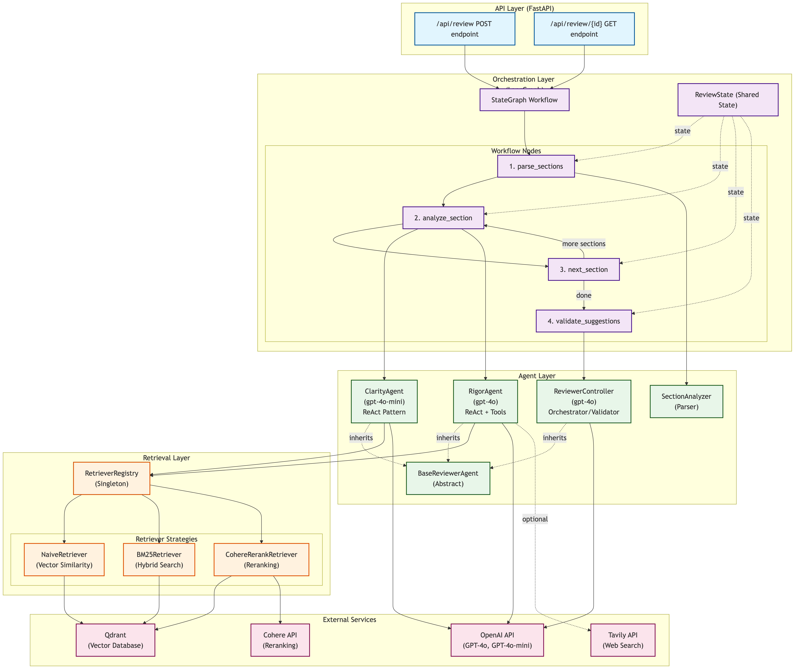

# Peerly: An Agentic Co-Reviewer for Technical Paper Writing

Peerly is a web-based multi-agentic system for co-reviewing technical research paper contents. Built with FastAPI, LangGraph, Next.js, and Qdrant, this application provides Grammarly-style suggestions tailored for academic research writing in mathematics, computer science, and related domains.

Loom video description of the app [here](https://www.loom.com/share/4198ee90231e487b964ec0bae21b7522?sid=2169ad2a-d40c-4ad2-b910-d825819c3698).

## 🎯 Features

- **Real-time Peer Review**: Get instant, targeted feedback on your research paper as you write
- **⭐ LangGraph Workflow**: StateGraph-based orchestration with Pydantic BaseModel state management
  - **Clarity Agent**: Identifies unclear statements, complex sentences, and undefined jargon
  - **Rigor Agent**: Validates experimental and mathematical rigor, statistical appropriateness, and assumptions
  - **Orchestrator Validation**: Final validation, prioritization, and cross-checking of suggestions
  - **Section-wise Analysis**: Each section analyzed independently for focused feedback
  - **Fast & Efficient**: 5-10 seconds for typical papers with optimized token usage
- **Split-View Interface**: Write in Markdown on the left, view suggestions on the right
- **Severity Levels**: Color-coded suggestions (Info, Warning, Error)
- **Filterable Suggestions**: Filter by type and severity for focused review

## 🏗️ System Architecture

The system uses **LangGraph StateGraph** for orchestrating a multi-agent peer review workflow with type-safe state management.



### Core Components

**API Layer (FastAPI)**
- `/api/review` POST endpoint - Submit papers for review
- `/api/review/{id}` GET endpoint - Retrieve review results

**Orchestration Layer (LangGraph StateGraph)**
- Manages workflow with explicit state transitions and conditional logic
- Processes papers section-by-section in a loop until complete

**Agent Layer**
- **ClarityAgent** (`gpt-4o-mini` + ReAct): Analyzes all sections for unclear text, vague references, and undefined terms
- **RigorAgent** (`gpt-4o` + ReAct + Tools): Validates experimental/mathematical rigor in methods, results, and proofs sections
- **ReviewerController** (`gpt-4o`): Orchestrates workflow, validates suggestions, filters contradictions, and prioritizes feedback
- **SectionAnalyzer**: Parses markdown into structured sections with hierarchy

**Retrieval Layer**
- **RetrieverRegistry**: Singleton pattern for managing retriever strategies
- **NaiveRetriever**: Vector similarity search using embeddings
- **BM25Retriever**: Hybrid search combining keyword matching and semantic similarity
- **CohereRerankRetriever**: Reranking-based retrieval using Cohere API

**External Services**
- **Qdrant**: Vector database for storing research guidelines
- **OpenAI API**: LLM models (`gpt-4o`, `gpt-4o-mini`) and embeddings
- **Cohere API**: Reranking for improved retrieval accuracy
- **Tavily API**: Web search for rigor validation

See [MODULAR_ARCHITECTURE.md](MODULAR_ARCHITECTURE.md) for detailed implementation.

## 📁 Project Structure

```
AIE8-certification-challenge/
├── backend/                               # Python backend (FastAPI + LangGraph)
│   ├── app/
│   │   ├── agents/                        # Agent modules
│   │   │   ├── base_agent.py              # Abstract base class for all agents
│   │   │   ├── review_controller_langgraph.py  # ⭐ LangGraph StateGraph workflow
│   │   │   ├── review_controller.py       # Legacy simple controller
│   │   │   ├── clarity/                   # Clarity agent module
│   │   │   │   ├── __init__.py
│   │   │   │   └── clarity_agent.py       # Writing clarity analyzer
│   │   │   ├── rigor/                     # Rigor agent module
│   │   │   │   ├── __init__.py
│   │   │   │   └── rigor_agent.py         # Experimental/math rigor validator
│   │   │   └── section/                   # Section parsing utilities
│   │   │       ├── __init__.py
│   │   │       └── section_analyzer.py    # Markdown parser + truncation
│   │   ├── models/                        # Pydantic data models
│   │   │   ├── __init__.py
│   │   │   └── schemas.py                 # ReviewState, Suggestion, etc.
│   │   ├── prompts/                       # Prompt templates
│   │   │   ├── clarity_agent/
│   │   │   │   └── prompts.py             # Clarity agent prompts
│   │   │   ├── rigor_agent/
│   │   │   │   └── prompts.py             # Rigor agent prompts
│   │   │   └── review_controller/
│   │   │       └── prompts.py             # Orchestrator prompts
│   │   ├── retrievers/                    # RAG retrieval strategies
│   │   │   ├── registry.py                # Retriever registry (Singleton)
│   │   │   ├── config_helper.py           # Retriever configuration
│   │   │   ├── builders.py                # Builder classes for retrievers
│   │   │   ├── naive.py                   # Vector similarity retriever
│   │   │   ├── bm25.py                    # Hybrid BM25 + vector retriever
│   │   │   └── cohere_rerank.py           # Cohere reranking retriever
│   │   ├── routers/                       # FastAPI route handlers
│   │   │   ├── __init__.py
│   │   │   └── review.py                  # Review endpoints + WebSocket
│   │   ├── scripts/                       # Utility scripts
│   │   │   └── upload_guidelines.py       # Upload PDFs to Qdrant
│   │   ├── services/                      # Business logic services
│   │   │   ├── __init__.py
│   │   │   ├── vector_store.py            # Qdrant vector store service
│   │   │   └── tavily_service.py          # Tavily web search service
│   │   ├── __init__.py
│   │   ├── config.py                      # Application configuration (Pydantic Settings)
│   │   └── main.py                        # FastAPI application entry point
│   ├── eval/                              # ⭐ RAG evaluation infrastructure
│   │   ├── data/golden/                   # Golden datasets (10 samples per agent)
│   │   │   ├── golden_clarity_10.csv
│   │   │   └── golden_rigor_10.csv
│   │   ├── results/                       # Evaluation results (by retriever config)
│   │   │   ├── clarity_naive_k8/          # Example: Naive retriever results
│   │   │   └── rigor_bm25_k10/            # Example: BM25 retriever results
│   │   ├── golden_dataset/                # Golden dataset generation scripts
│   │   ├── evaluate_rag_performance.py    # Main evaluation script
│   │   ├── custom_retrieval_metrics.py    # Custom context metrics
│   │   ├── plot_retriever_comparison.py   # Visualization script
│   │   └── EVAL_README.md                 # Evaluation guide
│   ├── .env.example                       # Environment variables template
│   ├── pyproject.toml                     # Python project config (uv)
│   ├── uv.lock                            # UV lock file for dependencies
│   ├── architecture.png                   # System architecture diagram
│   ├── run.sh                             # Backend startup script
│   ├── test_modular.py                    # Test script for simple controller
│   └── test_langgraph.py                  # Test script for LangGraph workflow
├── frontend/                              # Next.js frontend (TypeScript + React)
│   ├── src/
│   │   ├── app/                           # Next.js app router
│   │   │   ├── globals.css                # Global styles
│   │   │   ├── layout.tsx                 # Root layout component
│   │   │   └── page.tsx                   # Main page (split-view editor)
│   │   ├── components/                    # React components
│   │   │   ├── Editor.tsx                 # Markdown editor with line numbers
│   │   │   └── SuggestionPanel.tsx        # Suggestions display + filters
│   │   └── types/                         # TypeScript type definitions
│   │       └── index.ts                   # Shared types (Suggestion, etc.)
│   ├── .env.local.example                 # Frontend env template
│   ├── Dockerfile                         # Frontend Docker config
│   ├── next.config.js                     # Next.js configuration
│   ├── package.json                       # Node dependencies
│   ├── postcss.config.js                  # PostCSS config (Tailwind)
│   ├── tailwind.config.js                 # Tailwind CSS config
│   └── tsconfig.json                      # TypeScript config
├── docker-compose.yml                     # Docker composition for all services
├── start.sh                               # Quick start script (all services)
├── .dockerignore                          # Docker ignore patterns
├── .gitignore                             # Git ignore patterns
├── uv.lock                                # UV lock file (root)
├── GETTING_STARTED.md                     # Setup guide for new users
├── MODULAR_ARCHITECTURE.md                # LangGraph architecture documentation
├── QUICK_REFERENCE.md                     # Command reference card
└── README.md                              # This file
```

## 🚀 Quick Start

### Prerequisites

- **Python**: 3.10 or higher
- **Node.js**: 18.x or higher
- **Docker**: For running Qdrant vector database
- **OpenAI API Key**: Required for LLM and embeddings ([get one here](https://platform.openai.com/api-keys))

### Step 1: Start Qdrant (Vector Database)

Open a terminal and start Qdrant with Docker:

```bash
docker run -d -p 6333:6333 -p 6334:6334 \
    -v $(pwd)/qdrant_storage:/qdrant/storage \
    qdrant/qdrant
```

**What's happening?** Starting a local vector database for storing and retrieving research guidelines.

Alternatively, use [Qdrant Cloud](https://cloud.qdrant.io/) and update the configuration in `.env`.

### Step 2: Backend Setup

Open a new terminal:

```bash
# Navigate to backend folder
cd backend

# Install uv (fast Python package manager) if not already installed
curl -LsSf https://astral.sh/uv/install.sh | sh  # macOS/Linux
# Windows: powershell -c "irm https://astral.sh/uv/install.ps1 | iex"

# Create virtual environment and install dependencies
uv venv
source .venv/bin/activate  # On Windows: .venv\Scripts\activate
uv pip install -e .

# Configure environment variables
cp .env.example .env
# Edit .env and add your OPENAI_API_KEY=sk-...
```

**Edit `.env` with your credentials:**

```env
OPENAI_API_KEY=sk-your-key-here
QDRANT_HOST=localhost
QDRANT_PORT=6333
QDRANT_API_KEY=
CORS_ORIGINS=http://localhost:3000
```

**Start the backend server:**

```bash
uvicorn app.main:app --host 0.0.0.0 --port 8000 --reload
```

Backend will be available at:
- API: `http://localhost:8000`
- Interactive docs: `http://localhost:8000/docs`

### Step 3: Frontend Setup

Open another terminal:

```bash
# Navigate to frontend folder
cd frontend

# Install Node dependencies
npm install

# Configure environment (optional, defaults work)
cp .env.local.example .env.local

# Start the development server
npm run dev
```

Frontend will be available at: `http://localhost:3000`

### Step 4: Try It Out!

1. **Open your browser** to `http://localhost:3000`
2. **Paste sample content** into the editor (or use your own paper)
3. **Click "Review Paper"** and see AI-powered suggestions appear!

## 📖 Usage Guide

### Basic Workflow

1. **Open the Application**: Navigate to `http://localhost:3000`

2. **Write Your Paper**: Use the left-side Markdown editor to write your research paper

3. **Trigger Review**: Click the "Review Paper" button to analyze your content

4. **Review Suggestions**: View categorized suggestions in the right panel

5. **Filter Results**: Use the filter dropdowns to focus on specific types or severities

### Uploading Guidelines (Future Feature)

The system includes infrastructure for RAG-based guideline integration. To upload PDF guidelines:

```bash
curl -X POST "http://localhost:8000/api/review/upload-guidelines" \
  -H "Content-Type: multipart/form-data" \
  -F "file=@path/to/your/guideline.pdf"
```

Or use the Swagger UI at `http://localhost:8000/docs`

**Note**: RAG integration is not yet active in the LangGraph workflow but infrastructure is ready for future enhancement.

### Using the WebSocket Endpoint

For real-time streaming suggestions (advanced use):

```javascript
const ws = new WebSocket('ws://localhost:8000/api/review/ws/session_123');

ws.onopen = () => {
  ws.send(JSON.stringify({
    type: 'review',
    content: '# Your Paper\n\nContent here...',
    target_venue: 'NeurIPS'
  }));
};

ws.onmessage = (event) => {
  const data = JSON.parse(event.data);
  if (data.type === 'suggestions') {
    console.log('Received suggestions:', data.suggestions);
  }
};
```

## 🔧 Component Details

### Backend Components

#### 1. **Configuration (`config.py`)**
- Manages environment variables using Pydantic Settings
- Centralized configuration for API keys, Qdrant, and LLM settings

#### 2. **LangGraph Review Controller (`agents/review_controller_langgraph.py`)** ⭐
- **StateGraph-based workflow orchestrator**
- Uses Pydantic `ReviewState` BaseModel for type-safe state management
- Implements conditional edges and graph-based workflow
- Section-by-section processing with automatic looping
- Built-in orchestrator validation node

**Workflow Nodes:**
- `parse_sections`: Parse markdown into structured sections
- `analyze_section`: Run Clarity and Rigor agents concurrently
- `next_section`: Increment section counter
- `should_continue`: Conditional edge (continue or validate)
- `validate_suggestions`: Orchestrator cross-validation and prioritization

#### 3. **Base Agent (`agents/base_agent.py`)**
- Abstract base class for all review agents
- Provides common LLM invocation and parsing methods
- Standardized suggestion creation
- JSON response parsing with error handling

#### 4. **Clarity Agent (`agents/clarity/clarity_agent.py`)**
- Analyzes writing clarity for all sections
- Detects unclear statements, complex sentences, undefined jargon
- Uses structured LLM output with Pydantic models

#### 5. **Rigor Agent (`agents/rigor/rigor_agent.py`)**
- Validates experimental and mathematical rigor
- Smart filtering: only analyzes relevant sections (methods, results, etc.)
- Checks statistical tests, controls, sample sizes, proofs

#### 6. **Section Analyzer (`agents/section/section_analyzer.py`)**
- Markdown parsing with section hierarchy
- Content truncation for token limits (max 2000 tokens/section)
- Section filtering by keywords
- Structure summarization

#### 7. **Pydantic Models (`models/schemas.py`)**
- `ReviewState`: LangGraph state with Annotated reducers
- `Section`: Structured section representation
- `Suggestion`: Typed suggestion with severity levels
- `OrchestratorDecision`: Structured output for validation
- `ReviewRequest`/`ReviewResponse`: API contracts

#### 8. **API Routers (`routers/review.py`)**
- REST endpoint: `/api/review/analyze` for batch analysis
- WebSocket endpoint: `/api/review/ws/{session_id}` for streaming
- Guideline upload: `/api/review/upload-guidelines` (future RAG)
- Uses dependency injection for controller and vector store

#### 9. **Vector Store Service (`services/vector_store.py`)**
- Qdrant integration for future RAG capabilities
- PDF processing and embedding generation
- Ready for guideline-based suggestions

#### 10. **Main Application (`main.py`)**
- FastAPI app with CORS middleware
- Dependency injection setup
- Lifespan management for startup/shutdown

### Frontend Components

#### 1. **Editor (`components/Editor.tsx`)**
- Markdown text area with line numbers
- Manual review trigger via button
- Real-time content tracking

#### 2. **Suggestion Panel (`components/SuggestionPanel.tsx`)**
- Displays categorized suggestions
- Filter by type and severity
- Color-coded cards with detailed information
- Loading states and empty states

#### 3. **Main Page (`app/page.tsx`)**
- Split-view layout (50/50)
- State management for content and suggestions
- API integration with axios
- Session ID generation

## 🧪 Testing & Evaluation

### Quick Start Test

1. **Start services** (see Quick Start above)

2. **Use the LangGraph test script**:
   ```bash
   cd backend
   python test_langgraph.py
   ```

3. **Via API**:
   ```bash
   curl -X POST "http://localhost:8000/api/review/analyze" \
     -H "Content-Type: application/json" \
     -d '{
       "content": "# Test Paper\n\n## Abstract\n\nWe propose a method.\n\n## Method\n\nOur approach works.",
       "session_id": "test_123",
       "target_venue": "NeurIPS"
     }'
   ```

### RAG Performance Evaluation

The system includes comprehensive evaluation infrastructure for testing retriever performance:

**Location**: `backend/eval/`

**Key Components**:
- **Evaluation Scripts**: `evaluate_rag_performance.py`, `custom_retrieval_metrics.py`
- **Golden Datasets**: `data/golden/` - 10 samples each for Clarity and Rigor agents
- **Results Storage**: `results/` - Organized by retriever configuration (e.g., `clarity_naive_k8/`, `rigor_bm25_k10/`)
- **Visualization**: `plot_retriever_comparison.py` - Generate comparison charts

**Metrics Evaluated**:
- **RAGAS Metrics**: Faithfulness, Answer Relevancy
- **Custom Retrieval Metrics**: Context Precision, Context Recall, Context F1

**Quick Evaluation**:
```bash
cd backend

# Evaluate both agents with current retriever config
python eval/evaluate_rag_performance.py --evaluator all

# Evaluate specific agent only
python eval/evaluate_rag_performance.py --evaluator clarity

# Generate comparison plots across different retriever configs
python eval/plot_retriever_comparison.py
```

**Results are saved to**: `backend/eval/results/{retriever_config}/`
- Per-agent detailed results: `{agent}_results_TIMESTAMP.json`
- Aggregated metrics: `{agent}_metrics.json`
- Comparison plots: `{agent}_retriever_comparison.png`

For detailed evaluation guide, see [`backend/eval/EVAL_README.md`](backend/eval/EVAL_README.md)

### Manual Testing via UI

1. Start both backend and frontend
2. Write sample content in the editor
3. Click "Review Paper"
4. Verify suggestions appear correctly
5. Test filters and interactions

### Example Test Paper

Use this sample to test the system:

```markdown
# Machine Learning Paper

## Abstract

We propose a new method for classification.

## Method

Our approach uses neural networks. The results are good.

## Results

As shown in Table 1, accuracy improved by 10%.

## Conclusion

Our method works well.
```

Expected suggestions:
- **Clarity**: Vague statements ("good", "works well"), undefined terms, unclear descriptions
- **Rigor**: Missing experimental setup, no statistical tests, undefined metrics, missing control experiments

**Note**: The LangGraph workflow includes an orchestrator validation step that filters and prioritizes suggestions.

## 🧠 LangGraph State Management

This system uses LangGraph's StateGraph with Pydantic BaseModel for robust state management:

### State Schema (`ReviewState`)

```python
class ReviewState(BaseModel):
    # Input
    content: str                    # Original markdown
    session_id: str                 # Session identifier
    target_venue: Optional[str]     # Target publication (future use)

    # Parsed data
    sections: List[Section] = []    # Parsed sections
    current_section_index: int = 0  # Loop counter

    # Agent outputs (Annotated with add reducer)
    clarity_suggestions: Annotated[List[Suggestion], operator.add] = []
    rigor_suggestions: Annotated[List[Suggestion], operator.add] = []

    # Final output
    all_suggestions: List[Suggestion] = []
    processing_complete: bool = False
```

### Token Management

For a paper with N sections:
- **Per Section**: Max 2000 tokens (automatic truncation)
- **Per Agent Call**: ~500-1000 tokens input + 500-1500 tokens output
- **Estimated Total**: N × 2 agents × 1500 tokens average
- **Orchestrator**: Additional ~1000-2000 tokens for validation

### Context Optimization

1. **Section-wise Processing**: Each section analyzed independently
   - Prevents context overflow
   - Enables efficient looping in StateGraph
   - Parallel agent execution per section

2. **Smart Filtering**: Rigor agent skips irrelevant sections
   - Checks section titles for keywords (method, experiment, result, proof, etc.)
   - Reduces unnecessary LLM calls by ~40%

3. **Content Truncation**: Automatic truncation if section exceeds 2000 tokens
   - Preserves complete sentences
   - Adds truncation marker
   - Maintains section structure

4. **Structured Outputs**: Pydantic models for type safety
   - Reduces parsing errors
   - Enables automatic validation
   - Supports LangChain's `with_structured_output()`

## 🐛 Debugging

### Backend Issues

**Qdrant Connection Errors**:
- Ensure Qdrant is running: `docker ps`
- Check connection settings in `.env`
- Verify port 6333 is accessible

**OpenAI API Errors**:
- Verify API key is valid
- Check quota and billing
- Monitor rate limits (tier-dependent)
- Use `gpt-4o-mini` for cost efficiency

**LangGraph Errors**:
- Check logs for `[LangGraph]` prefixed messages showing workflow execution
- Verify state transitions: parse_sections → analyze_section → next_section → should_continue
- Look for conditional edge decisions in logs
- If orchestrator fails, system falls back to all suggestions (graceful degradation)

**Token Limit Errors**:
- Section truncation happens automatically at 2000 tokens
- Check logs for truncation warnings
- Adjust `max_tokens` parameter in `SectionAnalyzer.truncate_section_content()`
- Monitor OpenAI API usage for rate limits

### Frontend Issues

**API Connection Errors**:
- Verify backend is running on port 8000
- Check CORS configuration in `.env`
- Inspect browser console for errors
- Test API directly: `curl http://localhost:8000/docs`

**Display Issues**:
- Clear browser cache
- Check React component rendering
- Verify data types match TypeScript definitions
- Check browser console for React errors

## 🔐 Security Considerations

- **API Keys**: Never commit `.env` files (already in `.gitignore`)
- **Input Validation**: All requests validated with Pydantic
- **CORS**: Configured for specific origins only
- **Rate Limiting**: Consider adding rate limiting middleware for production

## 🚀 Future Enhancements

### Planned Features

1. **RAG Integration**: Activate vector store for guideline-based suggestions
   - Use uploaded conference guidelines in orchestrator validation
   - Venue-specific feedback based on submission requirements

2. **Additional Agents**: Extend the StateGraph with new nodes
   - **Citations Agent**: Validate reference appropriateness
   - **Structure Agent**: Check section organization
   - **Coherence Agent**: Analyze logical flow between sections

3. **User Experience**:
   - Auto-trigger with debounced review after inactivity
   - Inline annotations: click suggestions to highlight text
   - Accept/Reject workflow for suggestions
   - Export PDF reports

4. **Advanced Features**:
   - Multi-file paper support
   - Real-time collaborative editing
   - LaTeX support (in addition to Markdown)
   - Integration with arXiv/Semantic Scholar APIs

5. **Performance**:
   - Caching for repeated analyses
   - Streaming suggestions via WebSocket (enhanced)
   - Batch processing for multiple papers

## 📚 Dependencies

### Backend
- **FastAPI**: Web framework
- **LangChain**: LLM orchestration
- **LangGraph**: Agent workflow management
- **Qdrant**: Vector database
- **OpenAI**: LLM and embeddings
- **Pydantic**: Data validation

### Frontend
- **Next.js**: React framework
- **TypeScript**: Type safety
- **Tailwind CSS**: Styling
- **Axios**: HTTP client
- **Lucide React**: Icons

## 📄 License

This project is provided as-is for educational and research purposes.

## 🤝 Contributing

This is a certification project. For improvements:
1. Create a feature branch
2. Test thoroughly
3. Submit a pull request with detailed description

## 📧 Contact

For questions or issues, please create an issue in the repository.

---

**Note**: This system uses AI models and should be considered as a helpful tool, not a replacement for human peer review. Always verify suggestions and apply critical thinking when revising your research papers.

